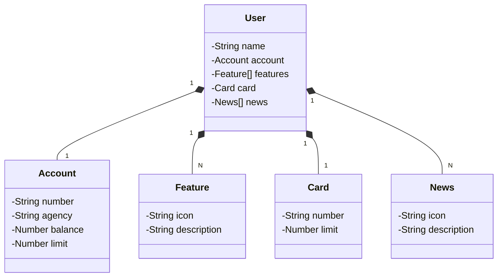

# api-restful-com-java-spring-boot-railway
Esse repositório armazena uma API Restful projetada com Java 22, Spring Boot e Railway. A mesma foi desenvolvida no Bootcamp Java Back-end, uma parceria do Banco Santader e Digitall Inovation One. Com ela, conseguimos cadastrar e recuperar dados usuário de um banco e sua conta.

## Diagrama de Classe - UML

